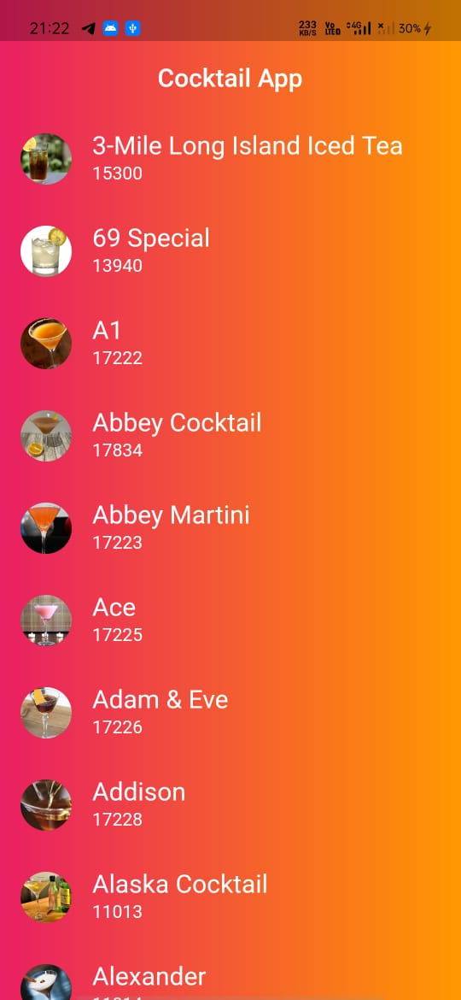
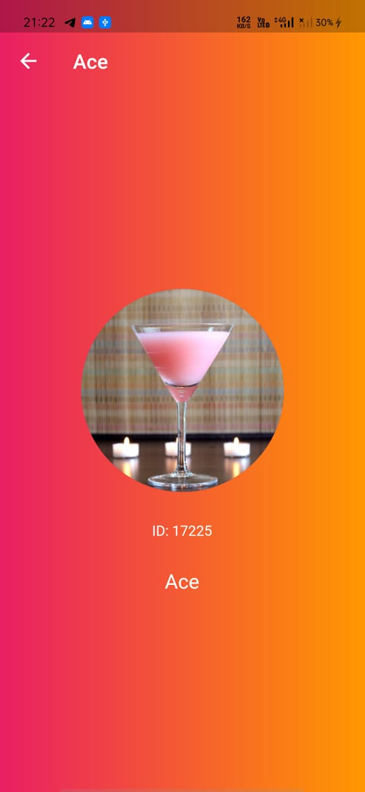

# Cocktail-app-using-Flutter

- In this app, All the data is fetch from api in which h json file is present.
- The data are image ,name and id of a drink.

<table>
  <tr>
    <td>First Screen Page</td>
     <td>Second Screen Page </td>
  </tr>
  <tr>
    <td valign="top"></td>
    <td valign="top"></td>
  </tr>
 </table>
